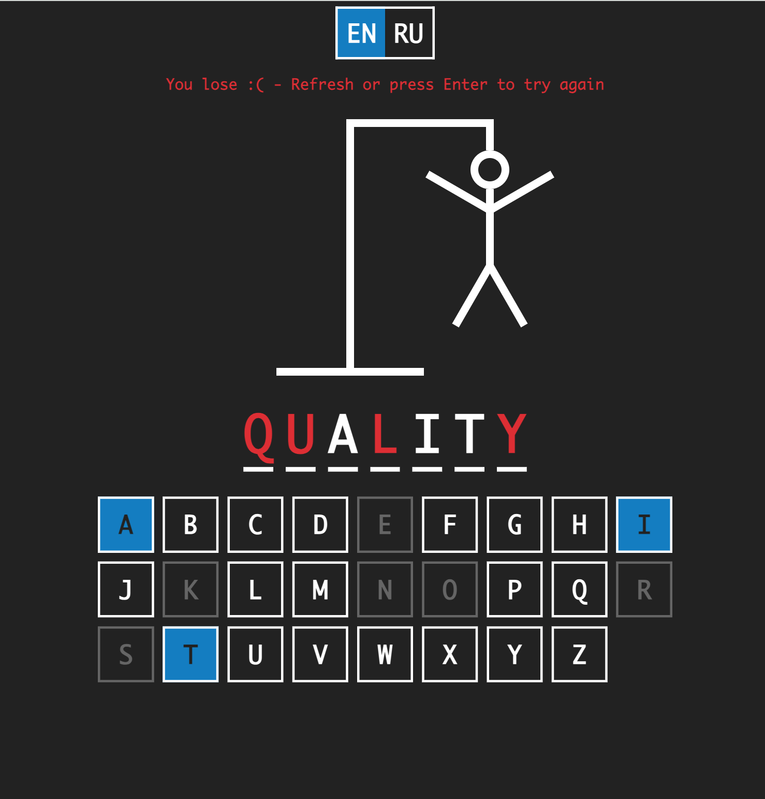

# Hangman Game  




### [Демо игры](https://kaktusgr.github.io/hangman/)

## Описание

Учебный проект интерактивной игры "Виселица". Игра реализована на **TypeScript** и **React**. 

Проект создан по обучающему [туториалу](https://www.youtube.com/watch?v=-ONUyenGnWw&list=WL&index=4) и дополнен собственными улучшениями.  

### Игра включает:

- Случайный выбор загаданного слова.
- Возможность выбора буквы с помощью виртуальной клавиатуры на экране или физической клавиатуры.
- Автоматическая отрисовка персонажа и отображение результата игры (победа/поражение).

### Самостоятельно реализованный функционал:

- Переключение режимов игры на русский/английский язык.  
- Обновление интерфейса с учетом выбранного языка.  
- Расширение списка слов для русского режима.   

## Установка и запуск  

Проект использует **Vite** как инструмент для сборки и разработки.  
Для работы с проектом у вас должны быть установлены **Node.js** и пакетный менеджер `npm`.  

1. Склонируйте репозиторий:  
  ```
  git clone <URL>
  ```

2. Установите зависимости:  
  ```
  npm install
  ```

3. Запустите приложение в режиме разработки:  
  ```
  npm run dev
  ```
  Приложение будет доступно по адресу: [http://localhost:5173/](http://localhost:5173/).  

4. Для сборки приложения в production:  
  ```
  npm run build
  ```
  Сборка будет сохранена в папке `dist`.

5. Для предпросмотра собранного проекта:
  ```
  npm run preview
  ```

